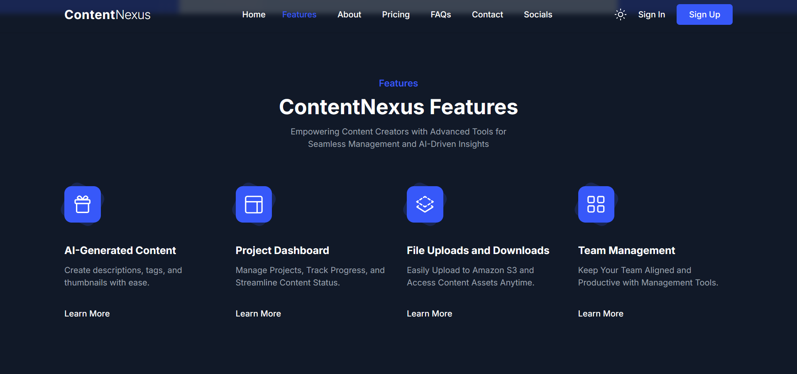
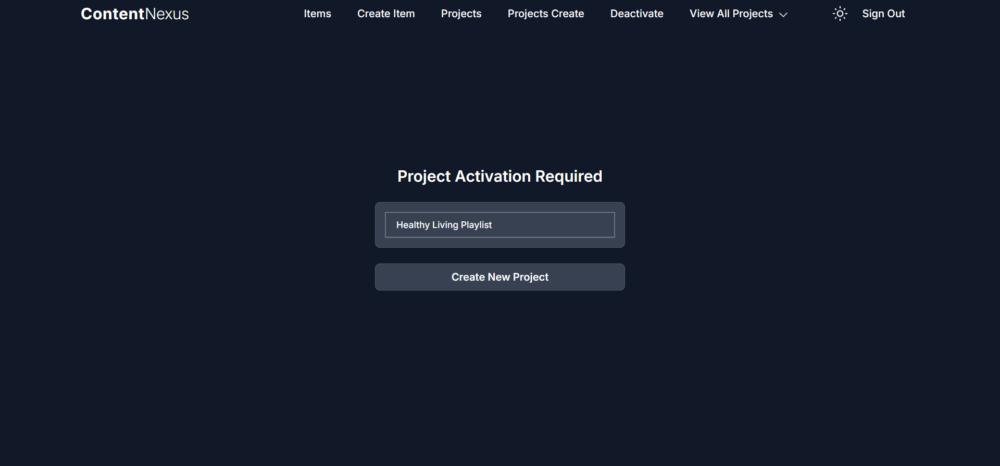
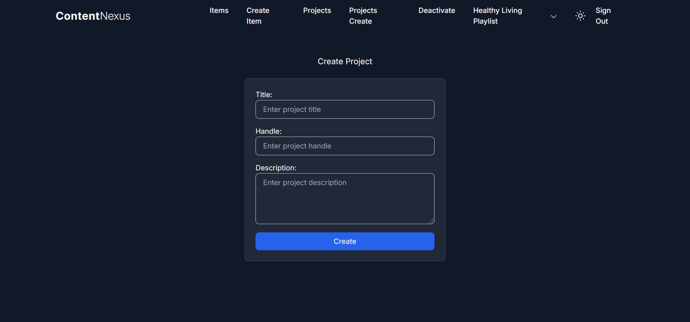
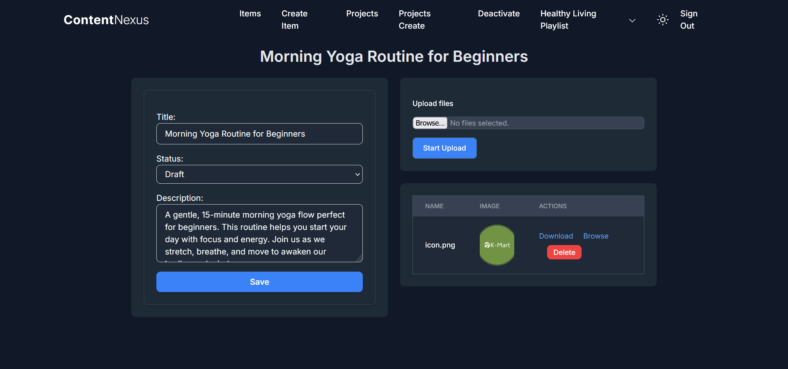

# Welcome to ContentNexus

## Project Overview
"Content creation is not just about the story you tell, but also the ease with which it's shared, recognized, and appreciated."
— Inspired by the dynamic landscape of digital media.

**ContentNexus** empowers creators to streamline their workflow, harness AI-driven tools, and reach wider audiences. By automating tasks like generating thumbnails, descriptions, and tags, ContentNexus enhances productivity, enabling creators to focus on producing quality content. Designed with an advanced project dashboard, this platform supports creators in efficiently managing and optimizing their content strategy for greater impact.

## Motivation
Content creation is increasingly competitive and time-intensive, with creators juggling multiple platforms, formats, and optimization requirements. The demands of constantly generating high-quality, optimized content can make it difficult to focus on creativity. ContentNexus was created to help solve this challenge by offering an AI-driven platform that streamlines content workflows, automates repetitive tasks, and provides insights—all in one place. This allows creators to focus on what they love while still maximizing engagement and efficiency.

## What It Does
ContentNexus uses AI to enhance various aspects of content creation, helping creators optimize and manage their projects:
- **Content Generation:** Automatically generate thumbnails, descriptions, tags, and other assets for videos, blogs, and social media posts.
- **Project Organization:** Manage and track content across platforms through a unified dashboard, keeping workflows streamlined.
- **Monetization:** Integrated with Stripe to facilitate payments, with future plans for course-selling capabilities directly within the platform.
- **Efficiency and Scalability:** Implements caching and optimized asset loading, ensuring fast and efficient performance across all features.

## Features
- **AI-Driven Content Tools:** Generate descriptions, tags, and thumbnails quickly, enhancing relevance and engagement with minimal manual effort.
- **Advanced Project Dashboard:** Centralize and track all aspects of content creation in a visually intuitive, easy-to-navigate dashboard.
- **Analytics for Optimization:** Provides insights and performance metrics, enabling creators to adapt and refine their content strategies.
- **Secure File Storage:** AWS S3 is used for file uploads, ensuring data security and scalability.

## How I Built It
ContentNexus was developed using a robust and scalable tech stack to ensure high performance, security, and flexibility:
- **Backend:** Built with Django, using PostgreSQL with NeonDB for a serverless experience.
- **Frontend:** HTML, CSS, and JavaScript, with HTMX for enhanced interactivity, and styled with Tailwind CSS for responsive and attractive designs.
- **Caching and Asset Management:** Used Django's caching for HTMX-rendered elements to reduce server load and improve speed. Custom commands like vendor_pull were implemented to manage static assets efficiently.
- **Containerization & CI/CD:** Docker for containerizing the application, with GitHub Actions for CI/CD, ensuring fast and reliable deployment.
- **Middleware and Custom Utilities:** Created custom middleware to inject project data into every request, custom validators to ensure unique project handles, and custom context processors for URL management.

## Challenges
Building ContentNexus required careful consideration to balance performance and functionality:
- **Efficient HTMX Rendering:** Caching HTMX-driven components to minimize render times was complex but essential for optimal performance.
- **Asset Management:** Developing the vendor_pull command streamlined static asset management, yet required customization to ensure smooth integration with Whitenoise and AWS S3.
- **Custom Middleware and Decorators:** Creating middleware to manage project context within requests and decorators to verify project status posed unique challenges, ultimately enhancing the system’s reliability.

## What I Learned
Building ContentNexus taught us valuable lessons in efficient backend development and the power of leveraging Django’s extensibility to create custom commands, context processors, and middleware. We gained expertise in integrating serverless databases, managing complex asset storage, and implementing real-time interactivity with HTMX while ensuring seamless project handling.

## What's Next for Vital
To continue evolving and meeting creators' needs, ContentNexus aims to:
- **Integrate Kubernetes:** Moving to Kubernetes will ensure scalable container management, enabling the platform to grow alongside its user base.
- **Course Platform Integration:** Adding a built-in course platform will allow creators to monetize their expertise by selling content and courses, providing an additional revenue stream.
- **Enhanced Analytics and AI Features:** Expanding AI capabilities to provide more personalized content insights and recommendations, helping creators further optimize their strategies.

---

## Getting Started
Welcome to ContentNexus! Follow the steps below to get your ContentNexus instance up and running with Docker.

### Prerequisites

- Ensure you have [Docker](https://docs.docker.com/get-docker/) installed on your system.

### Steps

### 1. Pull the Docker Image

Pull the latest ContentNexus Docker image from Docker Hub:

```bash
docker pull yogeshbhandare/content-engine
```
### 2. Run the Docker Container

Start a container using the image. You can map ports as needed. The following command maps the container's port 3000 to your local port 3000:

```bash
docker run -p 3000:3000 yogeshbhandare/content-engine
```

### 3. Access ContentNexus

Once the container is up and running, open your browser and navigate to:

```bash
http://localhost:3000
```
---

## Sanpshots

Home Page


About


Features


Project


Project Detail


Project Detail


Project Detail


---

Thank you for your interest in ContentNexus. We are dedicated to empowering content creators like you with innovative tools and streamlined workflows to bring your creative vision to life.
